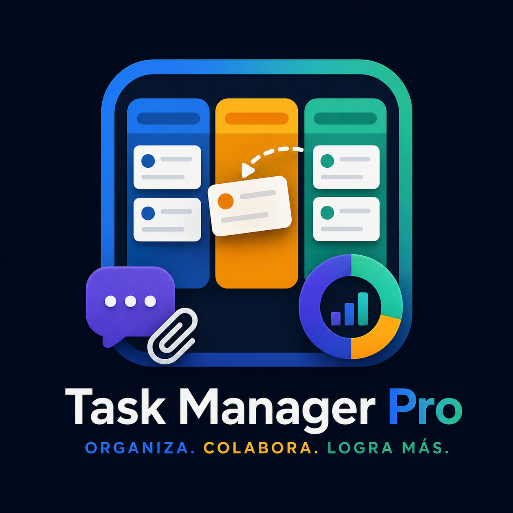

<div align="center">



# Task Manager Pro

**Aplicación full-stack para gestión de tareas con sistema Kanban, drag & drop, comentarios, archivos adjuntos, analytics con gráficos interactivos y notificaciones por email automatizadas.**

[](#)
[](#)

</div>

---

## 🚀 Quick Start (Docker — recomendado para equipos)

Requisito único: tener [Docker Desktop](https://www.docker.com/products/docker-desktop/) instalado. No necesitas instalar Node.js, MySQL ni nada más.

```bash
./setup.sh
```

Esto crea tu `.env` (con un `JWT_SECRET` generado automáticamente) y levanta base de datos, backend y frontend con un solo comando. Al terminar, abre **http://localhost:8080**.

Para que el resto del equipo entre desde su propia computadora (misma red privada/VPN/oficina), comparten la URL `http://<IP-de-esta-máquina>:8080` — el frontend detecta solo a qué servidor hablarle, no hay que reconfigurar nada por persona.

Comandos útiles:
```bash
docker compose logs -f       # ver logs
docker compose down          # apagar todo (los datos persisten)
docker compose down -v       # apagar y borrar también los datos
```

## 🛠️ Quick Start (desarrollo local, sin Docker)

Si vas a programar sobre el proyecto y prefieres correrlo directo con Node:

### 1. Backend

```bash
cd task-manager-api
npm install
cp .env.example .env
# Edita .env con tus credenciales de MySQL local
mysql -u root -p < schema.sql
npm run dev
```

### 2. Frontend

```bash
cd task-manager-frontend
npm install
npm run dev
```

### 3. Abre http://localhost:5173

## 📋 Requisitos

- **Con Docker:** solo Docker Desktop.
- **Sin Docker:** Node.js 18+ y MySQL 8+.
- Cuenta en [Resend.com](https://resend.com) para emails reales — opcional, sin ella los emails solo se registran en el log.

## 📁 Estructura

```
task-manager-api/      # Backend Node.js + Express
task-manager-frontend/ # Frontend React + Vite
docker-compose.yml     # Orquesta db + api + web
setup.sh               # Setup de un solo comando
```

## ✨ Características y Acciones Disponibles

- 📋 **Tablero Kanban Interactivo**: Organización visual de tareas por columnas (`To Do`, `In Progress`, `Done`) con soporte de **Drag & Drop** en tiempo real.
- 🎯 **Gestión Completa de Proyectos y Tareas**: Creación, edición, eliminación y filtrado por prioridad (`Baja`, `Media`, `Alta`) y fechas de vencimiento.
- 💬 **Comentarios en Hilo (Threaded Comments)**: Discusión estructurada por tarea con soporte para respuestas anidadas y eliminación por autor.
- 📎 **Archivos Adjuntos**: Carga y descarga dinámica de archivos directamente desde el panel de tareas.
- 📊 **Analytics e Informes de Productividad**: Gráficos interactivos de barra y dona (vía Recharts) para medir tareas por estado, prioridad y tasa de completado.
- 🛡️ **Protección Anti-IDOR Integrada**: Validación de pertenencia en todas las rutas de API para garantizar que ningún usuario acceda o modifique recursos ajenos.
- ✉️ **Notificaciones por Email (Resend)**: Envío automático de correos en eventos clave (creación de tarea, cambio de estado, nuevos comentarios).

## 🔒 Notas de seguridad al compartir con el equipo

- Cambia `JWT_SECRET` y `DB_PASSWORD` en `.env` antes de usarlo con gente real (el script ya genera el `JWT_SECRET` por ti).
- Si el servidor va a tener una URL fija dentro de tu red, define `ALLOWED_ORIGIN` en `.env` para que la API solo acepte pedidos desde ahí.
- MySQL no expone ningún puerto fuera de la red interna de Docker — solo el backend puede hablarle.

## 📝 Licencia

MIT - Ver archivo LICENSE
