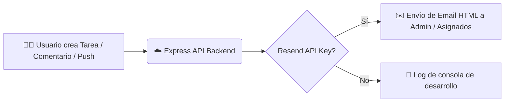

<div align="center">


# Task Manager Pro

**Aplicación full-stack para gestión de tareas con sistema Kanban, drag & drop, comentarios, archivos adjuntos, analytics con gráficos interactivos, notificaciones por email automatizadas, y panel de administración con roles, invitaciones y asignación de becarios a proyectos para colaborar en equipo.**

[](#)
[](#)

</div>

---

## 🚀 Quick Start (Docker — recomendado para equipos)

Requisito único: tener [Docker Desktop](https://www.docker.com/products/docker-desktop/) instalado. No necesitas instalar Node.js, MySQL ni nada más.

```bash
./setup.sh
```

Esto crea tu `.env` (con un `JWT_SECRET` generado automáticamente) y levanta base de datos, backend y frontend con un solo comando. Al terminar, abre **http://localhost:8080**.

Para que el resto del equipo entre desde su propia computadora (misma red privada/VPN/oficina), comparten la URL `http://<IP-de-esta-máquina>:8080` — el frontend detecta solo a qué servidor hablarle, no hay que reconfigurar nada por persona.

### 👤 Crear el primer administrador

El registro público está cerrado: solo se puede crear una cuenta con una invitación (ver [Roles e Invitaciones](#-roles-invitaciones-y-panel-de-administración)). Para el primer usuario (tú, el admin) no hay invitación previa, así que se crea a mano una sola vez:

```bash
# 1. Genera el hash de tu contraseña
docker compose exec api node -e "require('bcryptjs').hash('TU_PASSWORD', 10).then(console.log)"

# 2. Inserta el usuario admin con ese hash
docker compose exec db mysql -uroot -p"$DB_PASSWORD" taskmanager -e \
  "INSERT INTO users (name, email, password, role) VALUES ('Tu Nombre', 'tu@email.com', '<HASH_GENERADO>', 'admin');"
```

Inicia sesión con ese email/contraseña y ya puedes invitar al resto del equipo desde `/admin`.

Comandos útiles:
```bash
docker compose logs -f       # ver logs
docker compose down          # apagar todo (los datos persisten)
docker compose down -v       # apagar y borrar también los datos
```

## 🛠️ Quick Start (desarrollo local, sin Docker)

Si vas a programar sobre el proyecto y prefieres correrlo directo con Node:

### 1. Backend

```bash
cd task-manager-api
npm install
cp .env.example .env
# Edita .env con tus credenciales de MySQL local
mysql -u root -p < schema.sql
npm run dev
```

El registro está cerrado por invitación (ver sección de [Roles e Invitaciones](#-roles-invitaciones-y-panel-de-administración)). Para tu primer usuario admin, insértalo directamente en MySQL igual que en el flujo con Docker de arriba.

### 2. Frontend

```bash
cd task-manager-frontend
npm install
npm run dev
```

### 3. Abre http://localhost:5173

## 📋 Requisitos

- **Con Docker:** solo Docker Desktop.
- **Sin Docker:** Node.js 18+ y MySQL 8+.
- Cuenta en [Resend.com](https://resend.com) para emails reales — opcional, sin ella los emails solo se registran en el log.

## 📁 Estructura

```
task-manager-api/      # Backend Node.js + Express
task-manager-frontend/ # Frontend React + Vite
docker-compose.yml     # Orquesta db + api + web
setup.sh               # Setup de un solo comando
cloudflared/           # Plantilla de config para exponer el proyecto a internet
```

## ✨ Características y Acciones Disponibles

- 📋 **Tablero Kanban Interactivo**: Organización visual de tareas por columnas (`To Do`, `In Progress`, `Done`) con soporte de **Drag & Drop** en tiempo real.
- 🎯 **Gestión de Proyectos y Tareas por Membresía**: Un becario solo ve y trabaja en los proyectos donde el admin lo asignó; dentro de cada proyecto asignado, las tareas las genera libremente cada quien. El admin ve todos los proyectos sin restricción.
- 🧑‍💻 **Atribución de Tareas**: Cada tarjeta muestra avatar y nombre de quién la creó.
- 👀 **Vista de Equipo (admin)**: `/team` — KPIs del equipo (activas, completadas en la semana, vencidas, becarios activos), progreso por becario y feed de actividad reciente en tiempo real.
- 🧾 **Log de Actividad**: Registro histórico de tareas creadas, cambios de estado, comentarios, archivos subidos y proyectos creados — quién hizo qué y cuándo.
- 💬 **Comentarios en Hilo (Threaded Comments)**: Discusión estructurada por tarea con soporte para respuestas anidadas.
- 📎 **Archivos Adjuntos**: Carga y descarga dinámica de archivos directamente desde el panel de tareas.
- 👥 **Roles, Invitaciones y Panel de Administración**: El admin invita colaboradores por email, los asigna a proyectos y controla quién puede borrar contenido — ver [detalle abajo](#-roles-invitaciones-y-panel-de-administración).
- 📊 **Analytics e Informes de Productividad**: Gráficos interactivos de barra y dona (vía Recharts) para medir tareas por estado, prioridad y tasa de completado (vista personal, por usuario).
- 🛡️ **Registro Cerrado por Invitación**: Nadie puede crear una cuenta sin un token de invitación válido enviado por un administrador.
- ✉️ **Notificaciones por Email (Resend)**: Envío automático de correos en eventos clave (creación de tarea, cambio de estado, nuevos comentarios, invitaciones, asignación a un proyecto).

## 📖 Guía Visual de Funcionamiento y Mockups de Pantalla

A continuación se muestra en detalle cómo se interactúa con cada módulo y acción de **Task Manager Pro**:

### 1. 📋 Tablero Kanban & Drag & Drop
El tablero organiza las tareas en 3 columnas principales. Al arrastrar una tarjeta entre columnas, el estado se actualiza dinámicamente.

```text
┌───────────────────────────┬───────────────────────────┬───────────────────────────┐
│ 🟡 POR HACER (To Do)      │ 🔵 EN PROGRESO            │ 🟢 COMPLETADO (Done)      │
├───────────────────────────┼───────────────────────────┼───────────────────────────┤
│ ┌───────────────────────┐ │ ┌───────────────────────┐ │ ┌───────────────────────┐ │
│ │ 🔴 Alta               │ │ │ 🟡 Media              │ │ │ 🟢 Baja               │ │
│ │ Crear API Autenticación│ │ │ Implementar Dashboard │ │ │ Setup Docker Compose  │ │
│ │ 📅 Vence: 15/Aug      │ │ │ 📅 Vence: 12/Aug      │ │ │ 📅 Vence: 05/Aug      │ │
│ │ 💬 (3)  📎 (2)        │ │ │ 💬 (1)  📎 (0)        │ │ │ 💬 (5)  📎 (1)        │ │
│ └───────────────────────┘ │ └───────────────────────┘ │ └───────────────────────┘ │
│           │               │        🖱️ Arrastrar ───►  │                           │
│ ┌───────────────────────┐ │                           │                           │
│ │ 🟡 Media              │ │                           │                           │
│ │ Diseñar Mockups UI    │ │                           │                           │
│ └───────────────────────┘ │                           │                           │
└───────────────────────────┴───────────────────────────┴───────────────────────────┘
```

#### Acciones en el Tablero:
1. **Crear Tarea**: Haz clic en `+ Nueva Tarea`, ingresa título, descripción, prioridad (`Baja`, `Media`, `Alta`) y fecha límite.
2. **Arrastrar & Soltar**: Arrastra cualquier tarjeta hacia la columna de destino. El servidor recibe la petición y actualiza el estado.
3. **Filtros**: Selecciona un proyecto en la lista desplegable superior para filtrar las tarjetas del proyecto activo.

---

### 2. 💬 Sistema de Comentarios en Hilo (Threaded Comments)
Cada tarjeta cuenta con su propio panel modal de discusión estructurada.

```text
┌────────────────────────────────────────────────────────────────────────┐
│ 💬 Comentarios de la Tarea: "Crear API Autenticación"                  │
├────────────────────────────────────────────────────────────────────────┤
│ 👤 Carlos Dev  (01/Aug 14:30)                                          │
│ └─ "Ya agregué el middleware de JWT. Falta probar las cookies."        │
│    [ ↩️ Responder ]  [ 🗑️ Eliminar ]* (*solo visible para el admin)     │
│                                                                        │
│    └─ 👤 Ana Tech Lead  (01/Aug 14:35)                                │
│       └─ "Excelente Carlos. Recuerda validar la expiración a 24h."     │
│          [ ↩️ Responder ]                                               │
│                                                                        │
│ ┌────────────────────────────────────────────────────────────────────┐ │
│ │ ✍️ Escribe un comentario...                                         │ │
│ └────────────────────────────────────────────────────────────────────┘ │
│ [ 🚀 Publicar Comentario ]                                             │
└────────────────────────────────────────────────────────────────────────┘
```

#### Acciones en Comentarios:
- **Publicar en Hilo**: Haz clic en el ícono `💬` de cualquier tarjeta. Cualquier miembro del equipo (admin o becario) puede comentar.
- **Respuestas Anidadas**: Haz clic en `Responder` debajo de un comentario para abrir el cuadro de respuesta hijo.
- **Eliminación Restringida**: Solo el administrador puede eliminar comentarios (de cualquier persona); los becarios no ven el botón de borrar.

---

### 3. 📎 Gestión de Archivos Adjuntos (Attachments)
Permite subir evidencias, diagramas de arquitectura o requerimientos en PDF, PNG, ZIP, etc.

```text
┌────────────────────────────────────────────────────────────────────────┐
│ 📎 Archivos Adjuntos                                                   │
├────────────────────────────────────────────────────────────────────────┤
│ 📤 [ Subir archivo ]  (Arrastra o selecciona de tu equipo)             │
│                                                                        │
│ 📄 diagram_arquitectura.png   (Subido por Carlos Dev)                  │
│    [ 📥 Descargar ]  [ 🗑️ Eliminar ]*                                  │
│                                                                        │
│ 📦 requerimientos_v1.pdf      (Subido por Ana Tech Lead)               │
│    [ 📥 Descargar ]  [ 🗑️ Eliminar ]*                                  │
└────────────────────────────────────────────────────────────────────────┘
* Eliminar solo lo ve el administrador. Cualquiera puede subir y descargar.
```

---

### 4. 📊 Analytics e Informes de Productividad (Recharts)
Dashboard visual interactivo accesible desde la barra superior (`/analytics`).

```text
┌───────────────────────────────────────┬───────────────────────────────────────┐
│ 📊 Tareas por Estado                  │ 🎨 Distribución por Prioridad         │
├───────────────────────────────────────┼───────────────────────────────────────┤
│                                       │                                       │
│  10 ┤  █                              │              ██████ (45% Alta)        │
│   8 ┤  █      █                       │            ██        ██               │
│   6 ┤  █      █      █                │           ██  (35%)   ██ (20% Baja)   │
│   4 ┤  █      █      █                │            ██        ██               │
│   2 ┤  █      █      █                │              ██████ (Media)           │
│   0 └────┬──────┬──────┬──            │                                       │
│        Por    Progreso Completado     │                                       │
│        Hacer                          │                                       │
└───────────────────────────────────────┴───────────────────────────────────────┘
```

#### Métricas desplegadas:
- **Resumen Global**: Total de tareas, tareas completadas y % de tasa de éxito.
- **Desglose de Estados**: Gráficos de barras comparativos.
- **Distribución de Carga**: Gráfico circular (Dona) por severidad/prioridad.

---

### 5. ✉️ Notificaciones de Email Automatizadas (Resend Flow)



---

### 6. 👥 Roles, Invitaciones y Panel de Administración

Dos roles: **admin** (control total) y **guest/becario** (colaborador). El registro público está cerrado — la única forma de crear una cuenta es con un link de invitación de un solo uso que genera el admin. Un becario, además, **solo ve los proyectos donde el admin lo asignó explícitamente** — dentro de esos proyectos, genera y trabaja sus propias tareas libremente.

```text
┌────────────────────────────────────────────────────────────────────────┐
│ 🛠️ Panel de administración                                            │
├────────────────────────────────────────────────────────────────────────┤
│ Crear invitación                                                       │
│  Email: [ becario@email.com ]   Rol: [ Becario (guest) ▾ ]  [Enviar]   │
├────────────────────────────────────────────────────────────────────────┤
│ Invitaciones                                                           │
│  becario1@mail.com   guest   🟡 Pendiente   invitado por Admin  [Revocar]│
│  becario2@mail.com   guest   🟢 Usada       invitado por Admin          │
├────────────────────────────────────────────────────────────────────────┤
│ Proyectos y miembros                                                   │
│  (ALEX) Módulo de tickets   [ Alexander × ]   [+ Agregar becario ▾]    │
│  (OSCAR) Servicios/cliente  Sin becarios asignados [+ Agregar becario ▾]│
├────────────────────────────────────────────────────────────────────────┤
│ Usuarios registrados                                                   │
│  Admin Test      admin@mail.com      admin                             │
│  Becario Uno     becario1@mail.com   guest                             │
└────────────────────────────────────────────────────────────────────────┘
```

#### Qué puede hacer cada rol:

| Acción                          | Admin | Guest (becario) |
|----------------------------------|:-----:|:----------------:|
| Ver proyectos y tareas           | Todos | Solo donde está asignado |
| Crear tareas, comentar, subir adjuntos (en proyectos con acceso) | ✅ | ✅ |
| Editar tareas (en proyectos con acceso) | ✅ | ✅ |
| Crear/editar/borrar proyectos     | ✅ | ❌ |
| Asignar/quitar becarios de un proyecto | ✅ | ❌ |
| Borrar tareas, comentarios o adjuntos | ✅ | ❌ |
| Crear invitaciones / ver `/admin` | ✅ | ❌ |
| Ver `/team` (pulso del equipo)    | ✅ | ❌ |

#### Cómo invitar a alguien:
1. Entra a `/admin` (solo visible si tu cuenta es admin).
2. Escribe el email del colaborador y elige su rol.
3. Se le envía un correo con un link de un solo uso (`/register?token=...`), válido por 7 días.
4. Al registrarse, su cuenta queda con el rol que le asignaste — no puede elegirlo él mismo.
5. En la sección **Proyectos y miembros** de `/admin`, asígnalo a los proyectos donde debe trabajar — recibe un correo avisándole. Sin esta asignación, no ve ningún proyecto.

---

### 7. 📈 Vista de Equipo y Log de Actividad (admin)

Página `/team`, visible solo para admin, con el pulso del equipo en tiempo real:

```text
┌────────────────────────────────────────────────────────────────────────┐
│ 👥 Pulso del equipo                                                    │
├──────────────┬──────────────┬──────────────┬──────────────────────────┤
│ 14 Activas   │ 9 Completadas│ 3 Becarios   │ 2 Vencidas               │
│              │ esta semana  │ activos      │                          │
├──────────────┴──────────────┴──────────────┴──────────────────────────┤
│ Becarios                              │ Actividad reciente             │
│  Alexander  ▓▓░░░ 2 pend·1 curso·5 ok │  Mario completó "Endpoint..."  │
│  Mario      ▓░░░░ 1 pend·2 curso·2 ok │  Alexander comentó en "..."    │
│  Oscar      ▓▓▓░░ 3 pend·1 curso·2 ok │  Oscar subió un archivo a "..."│
└────────────────────────────────────────────────────────────────────────┘
```

Cada tarjeta de tarea en el tablero muestra además el avatar y nombre de quién la creó. El feed de actividad y el desglose por becario se alimentan de una tabla `activity_log` que registra: tarea creada, cambio de estado (de → a), comentario, archivo subido y proyecto creado.

## 🌐 Exposición a Internet (Cloudflare Tunnel)

Para que el equipo entre desde fuera de tu red (no solo LAN/VPN), usa [Cloudflare Tunnel](https://developers.cloudflare.com/cloudflare-one/connections/connect-networks/) en vez de abrir puertos en tu router: no expone tu IP ni requiere port-forwarding, y da HTTPS gratis.

**Un solo hostname para todo** (recomendado): en vez de dos subdominios separados (`app.` y `api.`), se rutea `/api/*` al backend y el resto al frontend, ambos bajo el mismo dominio. Esto evita CORS entre dominios y es más robusto si tu cuenta de Cloudflare ya tiene Workers/Pages con rutas wildcard (`*.tudominio.com/*`) — esas rutas interceptan el tráfico *antes* de llegar al túnel y pueden "tragarse" un subdominio nuevo sin que dé ningún error obvio; usar un solo hostname existente esquiva ese problema por completo.

1. Instala y autentica `cloudflared`, crea el túnel (`cloudflared tunnel create <nombre>`) y su ruta DNS (`cloudflared tunnel route dns <nombre> tudominio.com`).
2. Copia `cloudflared/config.yml.example` a `cloudflared/config.yml` y completa `<TUNNEL_ID>` y tu dominio. El ingress ya viene configurado con la regla de `path: ^/api/.*` apuntando al backend antes que la regla general del frontend — el orden importa, esa regla debe ir primero.
3. En `.env`, define `FRONTEND_URL` y `ALLOWED_ORIGIN` con tu URL pública, y `VITE_API_URL=https://tudominio.com/api` (mismo dominio, con `/api`). `VITE_API_URL` se hornea en el build, así que corre `docker compose build web && docker compose up -d web` después de cambiarla.
4. Corre `cloudflared tunnel run <nombre-del-tunel>` (o instálalo como servicio para que persista).

Si algo responde 404 de forma rara (funciona la raíz pero no `/api/...`, o viceversa, y ni reiniciar el túnel ni recrear el DNS lo arregla), revisa **Workers Routes** en el dashboard de Cloudflare de esa zona — un wildcard preexistente de otro proyecto tuyo puede estar interceptando el hostname nuevo. Agregar una ruta más específica con Worker en "None" para tu hostname soluciona el conflicto sin tocar la ruta original.

Nunca actives port-forwarding en el router para los puertos 3000/8080 — el túnel abre la conexión hacia afuera, no necesitas abrir nada entrante.

## 🔒 Notas de seguridad al compartir con el equipo

- Cambia `JWT_SECRET` y `DB_PASSWORD` en `.env` antes de usarlo con gente real (el script ya genera el `JWT_SECRET` por ti).
- Si el servidor va a tener una URL fija dentro de tu red, define `ALLOWED_ORIGIN` en `.env` para que la API solo acepte pedidos desde ahí (o la URL pública si usas Cloudflare Tunnel).
- MySQL no expone ningún puerto fuera de la red interna de Docker — solo el backend puede hablarle.
- El registro está cerrado por invitación: nadie entra sin que el admin lo invite explícitamente, y solo el admin puede borrar contenido.

## 📝 Licencia

MIT - Ver archivo LICENSE
